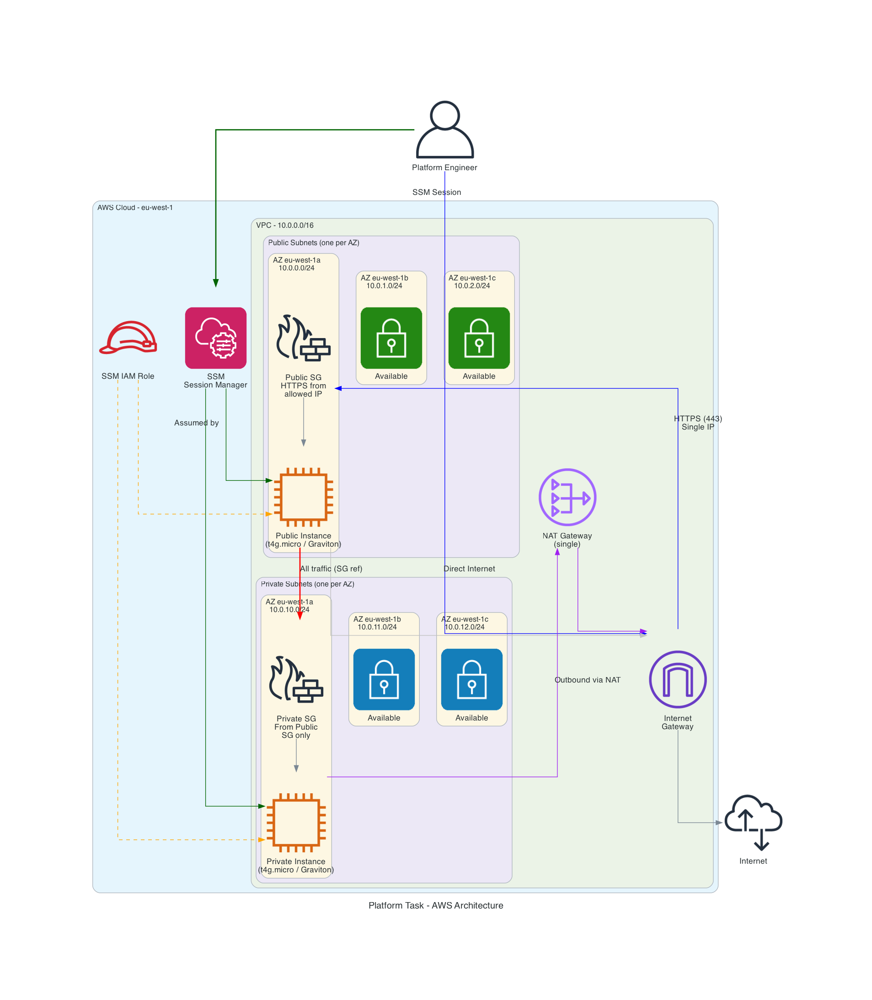

# Platform Task - Multi-Team AWS Infrastructure

A self-service platform that provisions isolated AWS environments per team using Terraform modules and Terragrunt. Each team gets its own VPC, EC2 instances, and security boundaries — onboarding is as simple as copying a config file.

## Architecture



### Per-Team Environment

Each team receives a fully isolated environment:

| Resource | Details |
|----------|---------|
| **VPC** | Dedicated CIDR (e.g. `10.1.0.0/16`) with DNS support |
| **Public Subnets** | One per AZ, dynamically computed via `cidrsubnet` |
| **Private Subnets** | One per AZ, dynamically computed via `cidrsubnet` |
| **Internet Gateway** | Attached to VPC for public subnet internet access |
| **NAT Gateway** | Single NAT GW — gives private subnets outbound internet |
| **Public EC2** | `t4g.micro` (Graviton/ARM64), Amazon Linux 2023 |
| **Private EC2** | `t4g.micro` (Graviton/ARM64), Amazon Linux 2023 |
| **IAM Role** | Per-team SSM instance profile |
| **Security Groups** | Public: HTTPS + SSH from a single IP. Private: from public SG only |
| **VPC Flow Logs** | CloudWatch Logs, 30-day retention |

### Design Decisions

- **Terragrunt for orchestration** — Each team gets isolated state files, preventing blast radius across teams
- **SSM as primary access** — No key management, fully auditable sessions via CloudTrail. SSH restricted to allowed IP as fallback
- **Graviton (ARM64)** — Better price/performance ratio vs x86
- **IMDSv2 enforced** — Instance metadata service hardened against SSRF
- **Encrypted EBS (gp3)** — Root volumes encrypted by default
- **Multi-AZ VPC** — Subnets span all available AZs in the region
- **VPC Flow Logs** — Network observability and security auditing
- **Community Terraform modules** — Battle-tested [terraform-aws-modules](https://github.com/terraform-aws-modules) for VPC, SGs, and EC2

## Prerequisites

- [OpenTofu](https://opentofu.org/docs/intro/install/) >= 1.5
- [Terragrunt](https://terragrunt.gruntwork.io/docs/getting-started/install/) >= 0.55
- [AWS CLI v2](https://docs.aws.amazon.com/cli/latest/userguide/getting-started-install.html) with configured credentials
- [Session Manager Plugin](https://docs.aws.amazon.com/systems-manager/latest/userguide/session-manager-working-with-install-plugin.html) for AWS CLI

```bash
tofu --version               # >= 1.5
terragrunt --version         # >= 0.55
aws sts get-caller-identity  # should return your account
```

## Quick Start

### Step 1: Bootstrap Remote State

```bash
cd bootstrap
tofu init
tofu apply
```

### Step 2: Configure Team Environments

Set the `allowed_ip` in each team's config:

```bash
# Find your public IP
curl -s https://checkip.amazonaws.com

# Edit each team's config
vi environments/team-alpha/terragrunt.hcl
vi environments/team-beta/terragrunt.hcl
```

### Step 3: Deploy

```bash
# Deploy all teams at once
cd environments
terragrunt run --all apply

# Or deploy a single team
cd environments/team-alpha
terragrunt apply
```

### Step 4: Connect via SSM

```bash
# Get connection commands from outputs
cd environments/team-alpha
terragrunt output ssm_connect_public
terragrunt output ssm_connect_private
```

### Step 5: Verify Internet Connectivity

Once connected via SSM:

```bash
curl -s https://checkip.amazonaws.com
```

- **Public instance** returns its own public IP
- **Private instance** returns the NAT Gateway's Elastic IP

## Onboarding a New Team

Adding a new team is a 3-step process:

```bash
# 1. Copy an existing team config
cp -r environments/team-alpha environments/team-newname

# 2. Edit the config
vi environments/team-newname/terragrunt.hcl
```

Update the inputs:

```hcl
inputs = {
  team_name     = "newname"
  environment   = "dev"
  vpc_cidr      = "10.3.0.0/16"    # Must not overlap with existing teams
  instance_type = "t4g.micro"
  allowed_ip    = "203.0.113.1/32"
}
```

```bash
# 3. Deploy
cd environments/team-newname
terragrunt apply
```

The new team gets its own VPC, instances, security groups, IAM role, and state file — completely isolated from other teams.

## Tear Down

```bash
# Destroy all teams
cd environments
terragrunt run --all destroy

# Destroy a single team
cd environments/team-alpha
terragrunt destroy

# Destroy bootstrap (optional)
cd bootstrap
# Remove prevent_destroy lifecycle rule first
tofu destroy
```

## Project Structure

```
.
├── bootstrap/                          # S3 bucket + DynamoDB for remote state
│   ├── main.tf
│   ├── variables.tf
│   ├── outputs.tf
│   └── versions.tf
├── modules/
│   └── team-environment/               # Reusable module — one environment per team
│       ├── main.tf                     # Locals, data sources (AZs, AMI)
│       ├── vpc.tf                      # Multi-AZ VPC, NAT GW, flow logs
│       ├── security.tf                 # Public + private security groups
│       ├── iam.tf                      # SSM role and instance profile
│       ├── compute.tf                  # Graviton EC2 instances
│       ├── variables.tf                # Module inputs
│       └── outputs.tf                  # Instance IDs, SSM commands
├── environments/
│   ├── root.hcl                        # Root config — provider, backend, common inputs
│   ├── team-alpha/
│   │   └── terragrunt.hcl             # Team Alpha inputs (vpc_cidr, allowed_ip, etc.)
│   └── team-beta/
│       └── terragrunt.hcl             # Team Beta inputs
├── setup.sh                            # Automated bootstrap + init
├── generated-diagrams/                 # Architecture diagram
└── README.md
```

### State Isolation

Each team's state is stored at a unique S3 key:

```
s3://platform-task-tfstate/
├── team-alpha/terraform.tfstate
├── team-beta/terraform.tfstate
└── team-newname/terraform.tfstate
```

Teams cannot affect each other's infrastructure — a `terragrunt destroy` in `team-alpha/` only touches Team Alpha's resources.

## Cost Estimate (Per Team)

| Resource | Cost |
|----------|------|
| NAT Gateway | ~$32 + $0.048/GB data processed |
| EC2 `t4g.micro` x2 | ~$15 (or free-tier eligible) |
| EBS gp3 volumes x2 | ~$2 |
| VPC Flow Logs (CloudWatch) | ~$0.50/GB ingested |
| **Total per team** | **~$50/month** |

Shared costs (S3 state bucket + DynamoDB lock table) are negligible (< $0.01/month).

## Production Considerations

- **SSM VPC Endpoints** — Interface endpoints for `ssm`, `ssmmessages`, `ec2messages` to keep SSM traffic on the AWS backbone
- **NAT Gateway per AZ** — One per AZ for high availability (`single_nat_gateway = false`)
- **CIDR Management** — Automated overlap detection in CI (e.g. `python3 check_cidr_overlaps.py`)
- **GitOps Pipeline** — PR-based workflow where new team configs are reviewed before merge triggers `terragrunt apply`
- **Monitoring** — CloudWatch alarms on instance health, NAT GW bandwidth, and Flow Log anomalies

## Community Modules Used

| Module | Version | Purpose |
|--------|---------|---------|
| [terraform-aws-modules/vpc/aws](https://registry.terraform.io/modules/terraform-aws-modules/vpc/aws) | ~> 5.21 | VPC, subnets, IGW, NAT GW, route tables, flow logs |
| [terraform-aws-modules/security-group/aws](https://registry.terraform.io/modules/terraform-aws-modules/security-group/aws) | ~> 5.3 | Public and private security groups |
| [terraform-aws-modules/ec2-instance/aws](https://registry.terraform.io/modules/terraform-aws-modules/ec2-instance/aws) | ~> 5.8 | EC2 instances with best-practice defaults |
